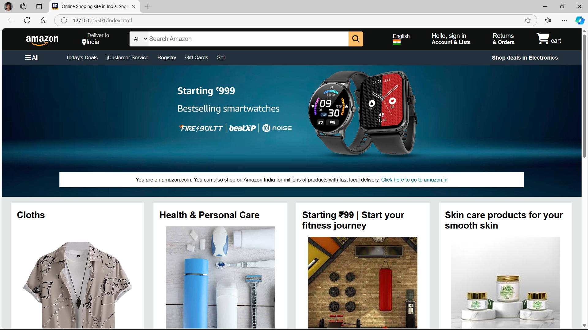
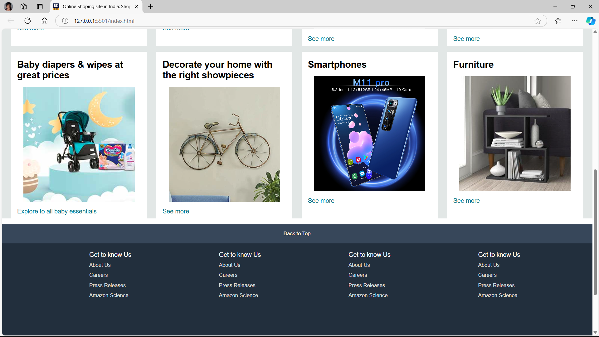

# Amazon
Amazon is one of the largest e-commerce platforms in the world, offering a wide range of products and services to consumers globally.

# Screenshots

# Description 
This is only UI (User Interface) based project.

# Features
Responsive project.

We applied a range of CSS properties that significantly enhance the overall user experience and visual appeal.

By applying different CSS properties based on the viewport width, we provided an optimized experience for both mobile and desktop users, enhancing accessibility and usability.

# How to run
Create two files: index.html, style.css.

Add the HTML structure in index.html, style in style.css.

Open the index.html file in a browser.
